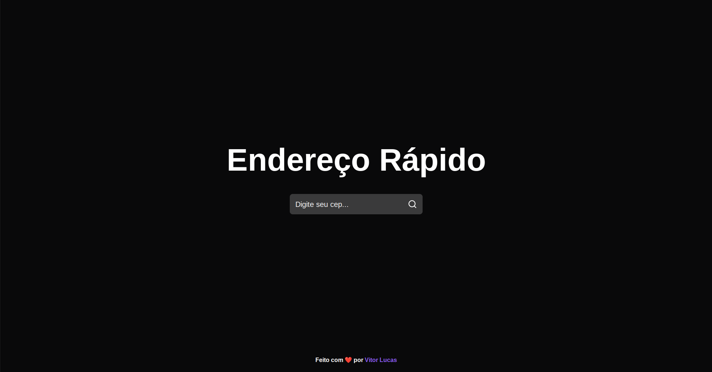

<h1 align="center">
Endereço Rápido
</h1>

O Endereço Rápido é um projeto simples que busca informações de endereço a partir de um CEP. Ele utiliza React para a interface e uma API pública para buscar as informações.

 

  <a href="#tecnologias">Tecnologias</a>&nbsp;&nbsp;&nbsp;|&nbsp;&nbsp;&nbsp;
  <a href="#projeto">Projeto</a>&nbsp;&nbsp;&nbsp;|&nbsp;&nbsp;&nbsp;
  <a href="#instalação">Instalação</a>&nbsp;&nbsp;&nbsp;|&nbsp;&nbsp;&nbsp;
  <a href="#como-usar">Como usar</a>&nbsp;&nbsp;&nbsp;|&nbsp;&nbsp;&nbsp;
  <a href="#licença">Licença</a>

 

  

 

## Tecnologias

Esse projeto foi desenvolvido com as seguintes tecnologias:

- React
- React-icons
- useState
- API externa
- CSS
- Google Fonts para fontes
- Arquivos de favicon

 

## Projeto

Este projeto é um aplicativo web desenvolvido com React, uma biblioteca JavaScript para construir interfaces de usuário. Ele permite que os usuários pesquisem informações de endereço a partir de um CEP fornecido. O usuário pode digitar o CEP desejado no campo de entrada e clicar no botão de busca. Se o CEP for válido, as informações de endereço, como logradouro, complemento, bairro, localidade e uf, serão exibidas na tela. Ele usa uma chamada de API para buscar informações de CEP de uma API externa. Além disso, ele usa também arquivo CSS para estilizar sua interface. O projeto está disponível no Github para uso e contribuição.

- [Acesse o projeto finalizado, online](Em breve)

 

## Instalação

Para instalar o Endereço Rápido, siga os seguintes passos:

1. Clone o repositório para sua máquina local com: git clone https://github.com/seuusername/endereco-rapido.git
2. Instale as dependências do projeto com "npm install"
3. Inicie o aplicativo com "npm start"

 

## 📖 Como usar

1. Digite o CEP desejado no campo de entrada.
2. Clique no botão de busca ou pressione Enter.
3. Se o CEP for válido, as informações de endereço serão exibidas na tela.

 

## 📝 Como contribuir

Contribuições são sempre bem-vindas! Para contribuir, siga estes passos:

1. Faça um fork do repositório.
2. Crie uma nova branch para as suas alterações (git checkout -b minhas-alteracoes)
3. Salve suas alterações e faça um commit (git commit -am 'Adicionando minhas alterações')
4. Envie suas alterações (git push origin minhas-alteracoes)
5. Crie uma nova solicitação de pull request.

 

## 🗒 Arquivos importantes

- App.js: contém a lógica da aplicação e a interface do usuário.
- services/api.js: contém a configuração da chamada à API.
- app.css: contém o estilo da aplicação.

 

## Dependências
- react: biblioteca para construção de interfaces.
- react-icons: pacote de ícones para o botão de busca.

 

## API
- Este projeto utiliza a API pública <a href="https://viacep.com.br/" target="_blank">ViaCEP</a> para buscar as informações de endereço.

 

## Licença

Este projeto está licenciado sob a licença MIT. Consulte o arquivo LICENSE para obter mais informações.

 

## Créditos

Este projeto foi desenvolvido por <a href="https://www.linkedin.com/in/euvtitordev/" target="_blank">Vitor Lucas</a>

 

## Contato

Se tiver alguma dúvida ou sugestão, entre em contato através do <a href="mailto:dev.vitorlucas@gmail.com" target="_blank">e-mail.</a>

 

<a href="https://instagram.com/euvitordev" target="_blank">Instagram</a>&nbsp;&nbsp;&nbsp;|&nbsp;&nbsp;&nbsp;
<a href="https://github.com/euvitordev" target="_blank">Github</a>&nbsp;&nbsp;&nbsp;|&nbsp;&nbsp;&nbsp;
<a href="https://linkedin.com/in/euvtitordev" target="_blank">LinkedIn</a>&nbsp;&nbsp;&nbsp;|&nbsp;&nbsp;&nbsp;
<a href="https://www.youtube.com/channel/UCgLnCW07t-4-y9YgDwI6bSw" target="_blank">Youtube</a>&nbsp;&nbsp;&nbsp;|&nbsp;&nbsp;&nbsp;
<a href="https://discord.gg/rm3sDKjf69" target="_blank">Discord</a>

 

Feito com ❤ por  <a href="https://www.linkedin.com/in/euvtitordev/" target="_blank">Vitor Lucas</a>

